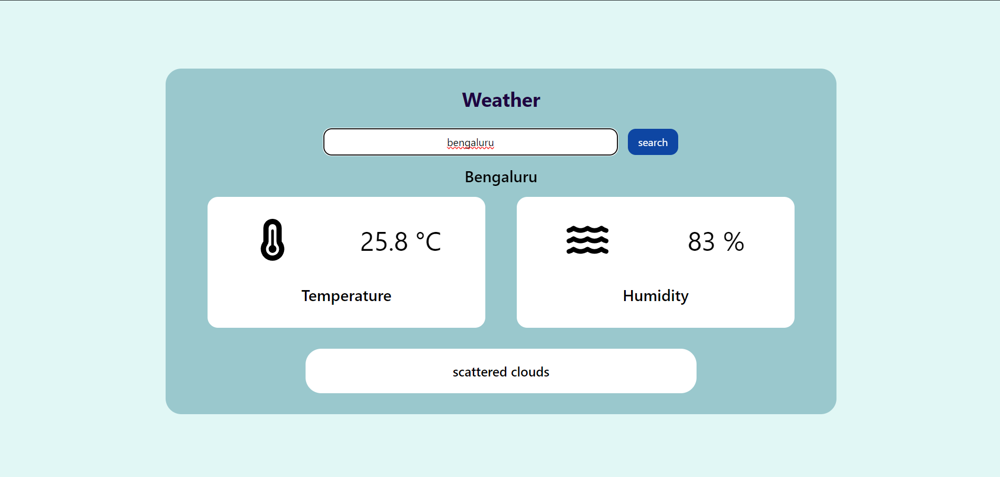
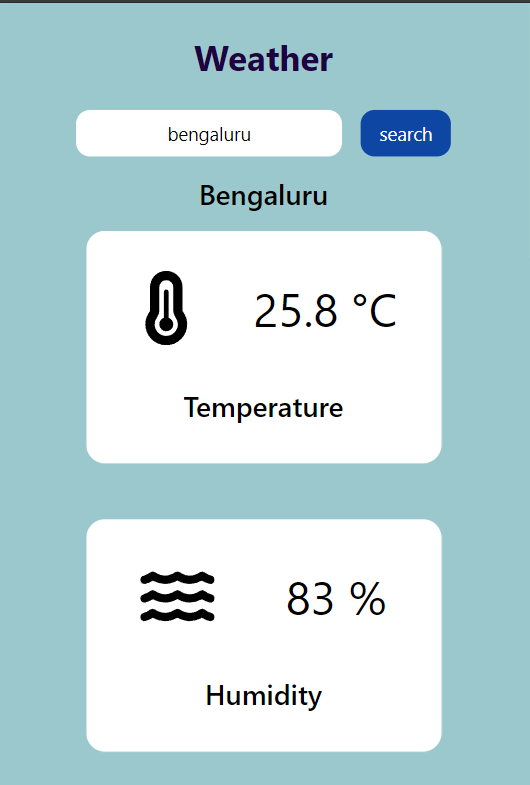

# Weather App

A simple Weather App built with React and Tailwind CSS that allows users to enter a city name and retrieve the current weather information for that city using the OpenWeatherMap API.

## Live link

[Click here](https://sage-zuccutto-aea9d2.netlify.app/)

# Screenshots



## Features

- Search for weather information by city name.
- Displays temperature, humidity, and weather description.
- Handles errors and displays appropriate messages.
- Uses Tailwind CSS for styling and animations.

## Installation

1. Clone the repository:
 ```bash
   git clone https://github.com/your-username/weather-app.git
   cd weather-app
   ```

2. Install dependencies:

 ```bash
  npm install
```

3. Create .env file in root directory. Get the api key from openweathermap.

    REACT_APP_API_KEY=your_openweathermap_api_key


4. Start the server

```bash
    npm start
    ```
